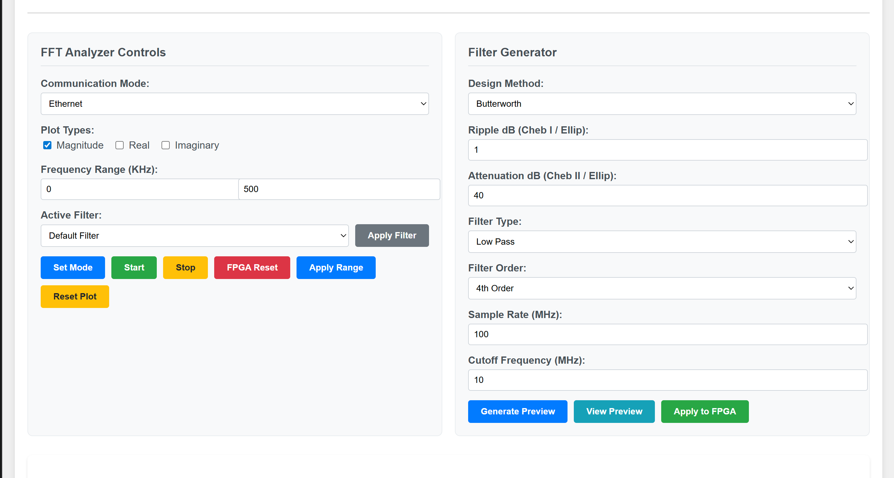

# FPGA-Based Real-Time FFT Analyzer with Configurable Filtering

A complete FPGA-based digital signal processing system featuring real-time FFT analysis, configurable IIR filtering, and dual-mode communication (UART/Ethernet). The system includes a Python-based GUI for filter design, coefficient management, and live spectrum visualization.

## Overview

This project implements a high-performance DSP system on FPGA that captures analog signals, applies windowing and filtering, performs FFT analysis, and streams results to a host computer for real-time visualization. The system supports both UART and Ethernet communication modes with a sophisticated web-based interface for control and monitoring. Because every RF-processing stage (windowing, filtering, FFT, framing) is implemented in re-configurable logic and controlled from software, the design is a receive-only Software-Defined Radio (SDR) platform.

### Key Features

- **Software-Defined Radio backend** – full digital signal chain runs in FPGA; filters, window, filter coefficients are changed from software at run-time
- **Real-time FFT Analysis**: 16K-point FFT processing at up to 1 MSPS
- **Configurable IIR Filtering**: 12th-order cascaded biquad filters with UART-loadable coefficients
- **Dual Communication**: UART (230400 baud) and Ethernet (RMII) interfaces
- **Live Visualization**: Web-based GUI with interactive spectrum plots
- **Filter Design Tools**: Built-in IIR filter designer with frequency response preview
- **Advanced Windowing**: Hann windowing for spectral leakage reduction

## System Architecture

ADC Input → Hann Window → IIR Filters → FFT → FIFO → UART/Ethernet → Python GUI

XADC 16K samples Configurable 16K Clock Dual-mode Web Interface
1 MSPS Q15 format Coefficients bins Domain Streaming & Control

## Software-Defined Radio Context
This project is a *receive-only SDR front-end*:

| Stage | SDR Equivalent |
|-------|----------------|
| XADC  | RF front-end / ADC |
| Hann window + IIR bank | Digital channel filtering |
| 16 k-point FFT         | Spectrum analysis |
| FIFO + UART/Ethernet   | Base-band I/Q streaming to host |

### FPGA Components

- **ADC Interface**: XADC for analog signal acquisition
- **Signal Processing**: Hann windowing, dual 12th-order IIR filters, 16K FFT
- **Communication**: RMII Ethernet MAC, UART transceiver, protocol handlers  
- **Memory Management**: Async FIFOs, dual-port RAM, coefficient storage
- **Control Logic**: Command decoder, sequencers, clock domain crossing

## Project Structure

### VHDL Source Files

| File | Description |
|------|-------------|
| `dsp_system_top.vhd` | Top-level system integration |
| `hann_window.vhd` | Windowing function implementation |
| `filter_iir12_cust.vhd` | Configurable 12th-order IIR filter |
| `shift2to8.vhd` | RMII nibble-to-byte converter |
| `ip_checksum_pipe.vhd` | Pipelined IP checksum calculator |
| `phy_rmii_if.vhd` | Ethernet PHY interface with TX/RX state machines |
| `fifo.vhd` | Asynchronous FIFO for clock domain crossing |
| `uart_tx.vhd` / `uart_rx.vhd` | UART communication modules |
| `crc.vhd` / `crc_gen.vhd` | CRC32 calculation engines |
| `pulse_synchronizer.vhd` | Safe pulse transfer between clock domains |
| `command_control.vhd` | UART command decoder and mode controller |

### Python Applications

#### 1. **FFT Analyzer GUI** (`scripts/fft_analyzer_gui.py` & `scripts/templates/index.html`)
**Main application providing:**
- **Web Interface**: Flask-based real-time spectrum analyzer
- **Dual Communication**: UART and Ethernet receiver backends  
- **Filter Designer**: Interactive IIR filter design with preview
- **Live Plotting**: Real-time FFT magnitude, phase, and I/Q visualization
- **FPGA Control**: Command interface for mode switching and configuration

**Key Features:**

- **Communication modes**:
- DEFAULT_COMM_MODE = `UART` or `ETHERNET`
- UART_BAUD = `230400`
- ETHERNET_PORT = `6006`

- **FPGA Commands**:
- FPGA_RESET_CMD = `0xFF`
- FILTER_UPDATE_CMD = `0xF1`
- START_COMMAND = `0x55`

#### 2. **Hann Window Generator** (`hann_coeff.py`)
**Utility script that:**
- Generates 16K-point Hann window coefficients
- Converts to Q15 fixed-point format (-32768 to +32767)
- Outputs `hann.vhd` package file for FPGA synthesis

## Hardware Requirements

- **FPGA**: Xilinx 7-series or compatible (with XADC, FFT IP, UART, Ethernet MAC)
- **Analog Input**: Single-ended or differential signal (compatible with XADC)
- **Ethernet PHY**: RMII-compatible (50MHz reference clock)
- **Serial Interface**: UART connection to host PC
- **Clock**: 100MHz system clock

## Software Setup

- **Vivado Version**: 2025.1
- **Development Board**: Digilent Nexys 4 with Artix-7 FPGA  

### Prerequisites

### Installation & Usage

1. **Clone Repository**
- git clone <repository-url>
- cd fpga-real-time-fft-analyzer

2. **Generate Window Coefficients**
- python3 hann_coeff.py
- Creates hann.vhd package file

3. **Build FPGA Design**
- Synthesize VHDL sources in Vivado/ISE
- Include generated `hann.vhd` package
- Configure FFT IP core for 16K-point complex FFT
- Set up clock constraints for 50MHz operation
- Pre-Generated Bitstream for Artix-7 FPGA on Nexys 4 board avaliable

4. **Launch Python GUI**
- python3 fft_analyzer_gui.py
- Opens web interface at http://localhost:5000

## Usage Guide

### Basic Operation
1. **Configure Communication**: Select UART or Ethernet mode
2. **Set Parameters**: Adjust frequency range, plot types, filter settings
3. **Design Filters**: Use built-in filter designer for custom responses  
4. **Start Acquisition**: Send start commands to begin FFT streaming
5. **Monitor Performance**: View real-time FPS, packet statistics

### Filter Configuration

- **Built-in filter types**:
- FILTER_DEFAULT_CMD = `0x00` # Use fixed coefficients
- FILTER_CUSTOM_CMD = `0xA1` # Use uploaded coefficients
- FILTER_NONE_CMD = `0xB1` # Bypass filtering

### Communication Protocols
- **UART Mode**: 230.4k baud, sends 0x55 + 0xA5 sequence
- **Ethernet Mode**: UDP packets with count-byte assembly
- **Command Interface**: Single-byte commands for configuration

## Performance Specifications

| Parameter | Value |
|-----------|-------|
| **Sample Rate** | Up to 1 MSPS (XADC dependent) |
| **FFT Size** | 16,384 points (complex) |
| **Frequency Resolution** | ~61 Hz per bin (at 1 MSPS) |
| **Filter Order** | 12th-order (dual cascaded biquads) |
| **Throughput** | 30 FPS over Ethernet, 0.3 FPS over UART |
| **Latency** | <10ms end-to-end (acquisition to display) |

## FPGA Metrics

**Implementation Strategy Used**: `Performance_EarlyBlockPlacement` 

---

## Post-Implementation Results

### Timing (Vivado `report_timing_summary`)

| Metric                     | Worst-case | Pass/Fail |
|----------------------------|-----------:|:---------:|
| **WNS** (ns)               | `0.113`   | `<✓>`     |
| **TNS** (ns)               | `0`        |           |
| **Fmax** (MHz)             | `101`      |           |

### Resource Utilization (Vivado `report_utilization`)

| Resource | Used  | Avail.  | Util.   |
|----------|------:|--------:|--------:|
| LUT      | `7930` | `63400` | `12.51%` |
| LUTRAM   | `752`  | `19000` | `3.96%` |
| FF       | `7995` | `126800`| `6.31%` |
| BRAM     | `50`   | `135`     | `37.04%`    |
| DSP      | `61`   | `240`     | `25.42%`    |
| MMCM     | `1`   | `6`     | `16.67%`|

 ---

## Web Interface Features

Access the control interface at `http://localhost:5000`:

- **Real-time Plots**: Interactive spectrum visualization
- **Filter Designer**: Butterworth, Chebyshev, Elliptic filter types
- **Configuration Panel**: Communication settings, frequency ranges
- **Performance Monitor**: FPS tracking, packet statistics
- **FPGA Control**: Reset, mode switching, filter selection

## Contributing

Contributions welcome! Areas for enhancement:
- Additional filter topologies (FIR, adaptive)
- Higher-order FFT support (32K, 64K points)  
- Multi-channel processing
- Advanced triggering modes
- Waterfall display options

## License

This project is licensed under the MIT License - see the [LICENSE](LICENSE) file for details.

